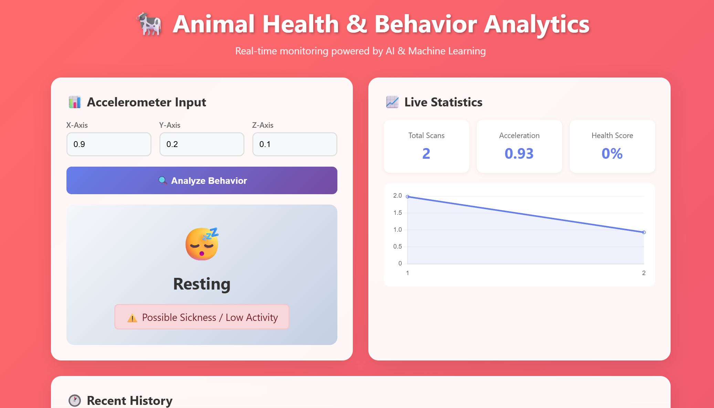

# Automated Livestock Behaviour Classification & Anomaly Detection (Hybrid ML System)

## 📌 Overview

This project develops a hybrid machine learning system for automatic cattle behaviour classification and anomaly detection using 50 Hz tri-axial accelerometer data. The system combines **LightGBM** for supervised behaviour classification and an **LSTM Autoencoder** for unsupervised anomaly detection, enabling both high-accuracy behaviour recognition and early health issue detection.

---

## 📂 Dataset

* **17 days of tri-axial accelerometer recordings (X, Y, Z) at 50 Hz**
* Captures grazing, rumination, resting, walking, and standing behaviours
* Includes preprocessed windows, normalization, and feature extraction steps

---

## ✨ Feature Engineering

### Time-Domain Features

* Signal Magnitude Area (SMA)
* Euclidean Norm Minus One (ENMO)
* Jerk Energy
* Total Acceleration

### Frequency-Domain Features

* Power Spectral Density (PSD)
* Behaviour-specific frequency bands to separate static vs active behaviours

---

## 🧠 Model Architecture

### **1. LightGBM Classifier (Supervised)**

* Trained on engineered time + frequency domain features
* Predicts: Grazing, Rumination, Resting, Walking
* Achieved **99.98% accuracy**

### **2. LSTM Autoencoder (Unsupervised)**

* Learns patterns from normal motion sequences
* Reconstruction error used as anomaly score
* Detects limping, trembling, unusual gait, and unseen abnormalities

---

## 🚀 Results

* **99.98% classification accuracy** using LightGBM
* High reconstruction-error separation for anomaly detection
* PSD features resolved misclassification issues in static behaviours
* End-to-end system is lightweight and suitable for real-time edge deployment

---

## 🔧 Workflow

1. Preprocessing (windowing + normalization)
2. Feature extraction (time & frequency domain)
3. Train LightGBM classifier
4. Train LSTM Autoencoder
5. Evaluate hybrid system
6. Deploy for real-time inference

---

## 📌 Applications

* Precision livestock farming
* Real-time cattle monitoring
* Early disease/health anomaly detection
* IoT/edge-enabled livestock analytics

---

## 📘 Future Enhancements

* Add GPS, temperature, and audio sensors
* Deploy fully on microcontrollers (ESP32/ARM)
* Use transformer-based time series encoders
* Adaptive anomaly thresholds
* Dashboard for farmers and veterinarians

---

## 👨‍💻 Author

**Ankur Gupta**
7th Semester Academic Project
B.Tech, Department of CSE
Indian Institute of Information Technology (IIIT) Guwahati

## 👩‍🏫 Supervisor

**Dr. Moumita Roy**
Assistant Professor, IIIT Guwahati
